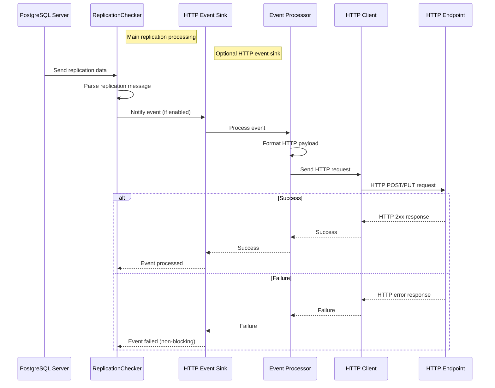

```mermaid
sequenceDiagram
	participant PG as PostgreSQL Server
	participant RC as ReplicationChecker
	participant HS as HTTP Event Sink
	participant EP as Event Processor
	participant HC as HTTP Client
	participant HE as HTTP Endpoint

	Note right of RC: Main replication processing
	Note right of HS: Optional HTTP event sink

	PG->>RC: Send replication data
	RC->>RC: Parse replication message
	RC->>HS: Notify event (if enabled)
	HS->>EP: Process event
	EP->>EP: Format HTTP payload
	EP->>HC: Send HTTP request
	HC->>HE: HTTP POST/PUT request
	alt Success
		HE-->>HC: HTTP 2xx response
		HC-->>EP: Success
		EP-->>HS: Success
		HS-->>RC: Event processed
	else Failure
		HE-->>HC: HTTP error response
		HC-->>EP: Failure
		EP-->>HS: Failure
		HS-->>RC: Event failed (non-blocking)
	end

```